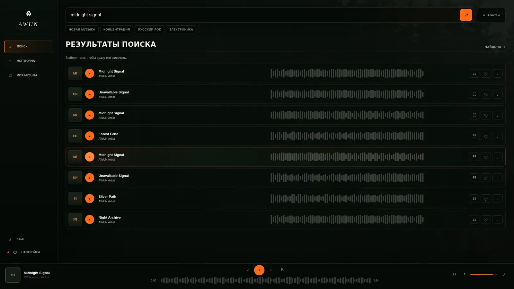
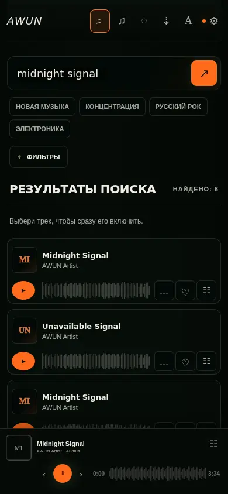
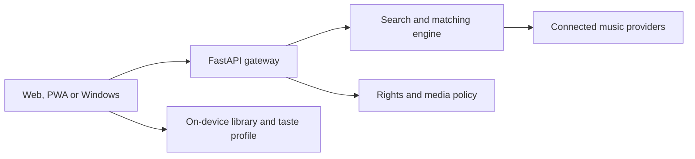

<div align="center">

[English](README.md) · [Русский](README.ru.md)

[](https://awun-1.onrender.com)
[](https://github.com/Loro66/AWUN/releases/latest/download/AWUN-Setup-x64.exe)
[](https://github.com/Loro66/AWUN/releases/latest)

[](https://github.com/Loro66/AWUN/actions/workflows/build-windows-exe.yml)
[](https://github.com/Loro66/AWUN/actions/workflows/frontend-e2e.yml)
[](https://www.python.org/)
[](https://fastapi.tiangolo.com/)
[](LICENSE.md)

**A local-first music discovery workspace for fragmented catalogs.**<br>
Search across connected sources, keep your library on your device and continue listening when one provider fails.

</div>

<p align="center">
  
</p>

## Why AWUN exists

Music discovery is split across services, regions, languages and scripts. A track may be easy to find on one platform and unavailable on another; saved stream URLs expire; one slow provider can hold up an otherwise useful search.

AWUN treats those failures as normal system conditions rather than exceptional cases.

| Product problem | AWUN response |
| --- | --- |
| Results are scattered across catalogs | Parallel search with progressive, source-by-source results |
| One provider is slow or unavailable | Partial results, deadlines, retry and per-source diagnostics |
| A saved stream URL has expired | Refresh on the same provider before playback |
| The active source stops working | High-confidence cross-source match with position recovery |
| Libraries are locked into accounts | Local CSV, JSON, M3U and TXT import with playable matching |
| Names differ across languages and scripts | MusicBrainz aliases, transliteration, release names and ISRC expansion |

## The product

| Discover | Listen | Keep | Understand |
| --- | --- | --- | --- |
| YouTube, SoundCloud, Audius, Jamendo and Internet Archive integrations | Official YouTube player, HLS playback, real or provider-derived waveforms | On-device library, persistent queue, backup and restore | Source health, latency, safe runtime report and explicit rights state |
| AUTO and regional discovery modes | Play next, append, reorder, repeat and Media Session | No mandatory account and no advertising profile | Track Stories with LRCLIB lyrics and optional Genius annotations |

### My Wave

My Wave turns the current track, local library and on-device taste signals into a continuous queue. Familiarity, mood, activity, language and era controls change each refill without uploading the taste profile.

<p align="center">
  
</p>

## How it works



The Windows application packages the frontend and FastAPI backend into one executable. It starts on an ephemeral loopback port and searches locally first. The public AWUN backend is only a provider-level fallback, so a remote cold start does not block healthy local sources.

Search results are normalized into a shared track model, deduplicated and ranked before the interface receives them. Playback recovery accepts an alternative only when title, artist and duration produce a sufficiently close match.

[Read the architecture](docs/ARCHITECTURE.md) · [Open the API reference](https://awun-1.onrender.com/docs)

## Install or run

### Windows

Download the [per-user installer](https://github.com/Loro66/AWUN/releases/latest/download/AWUN-Setup-x64.exe) or the [portable executable](https://github.com/Loro66/AWUN/releases/latest/download/AWUN.exe). SHA-256 files are published beside both binaries in every release.

The beta binaries are not Authenticode-signed yet, so Windows SmartScreen may show a warning. Verify the checksum before running the downloaded file.

### Web and PWA

Open [awun-1.onrender.com](https://awun-1.onrender.com). Chrome and Edge can install the site as a PWA from the browser menu.

### Development

```bash
git clone https://github.com/Loro66/AWUN.git
cd AWUN
python -m venv .venv

# Linux / macOS
source .venv/bin/activate

# Windows PowerShell
# .venv\Scripts\Activate.ps1

pip install -r requirements.txt
uvicorn backend.api.main:app --reload
```

Open `http://127.0.0.1:8000`. Optional provider credentials and deployment settings are documented in the [technical reference](docs/TECHNICAL_REFERENCE.md).

## Verified release quality

Release `v1.10.4` is built from `main` by GitHub Actions.

- **233 Python tests** cover search, ranking, matching, policy, reliability, security and desktop packaging.
- **26 Playwright scenarios** exercise progressive search, cancellation, provider deadlines, playback recovery, queue persistence, large libraries and responsive layouts.
- Visual and control-bound checks run at **1920, 1280, 1000 and 390 pixels**.
- The release workflow builds both Windows executables, generates SHA-256 checksums and publishes the versioned GitHub Release only after tests pass.

[Testing strategy and limitations](docs/TESTING.md) · [CI runs](https://github.com/Loro66/AWUN/actions) · [Latest release](https://github.com/Loro66/AWUN/releases/latest)

## Current status

| Surface | Status | Distribution |
| --- | --- | --- |
| Web / PWA | Public beta | [Open application](https://awun-1.onrender.com) |
| Windows | Released, unsigned beta | [Download v1.10.4](https://github.com/Loro66/AWUN/releases/tag/v1.10.4) |
| Android | Reproducible Play bundle and store package | Release requires Play Console signing and testing |
| iOS | Reproducible unsigned beta | Physical distribution requires Apple signing |

Public availability does not imply measured adoption. AWUN currently makes no claims about user count, retention or revenue. The [project case study](docs/PROJECT_CASE_STUDY.ru.md) separates implemented work from planned user validation.

## Documentation

| Document | Purpose |
| --- | --- |
| [Architecture](docs/ARCHITECTURE.md) | Components, data flow, trust boundaries and engineering decisions |
| [Testing](docs/TESTING.md) | Test layers, CI evidence, commands and known limitations |
| [Technical reference](docs/TECHNICAL_REFERENCE.md) | API, configuration, provider behavior and deployment |
| [Changelog](CHANGELOG.md) | User-visible release history |
| [Project case study](docs/PROJECT_CASE_STUDY.ru.md) | Verifiable development episodes and project ownership |
| [Security](SECURITY.md) | Private vulnerability reporting and supported version |
| [Contributing](CONTRIBUTING.md) | Development and pull-request requirements |

## Boundaries by design

AWUN is not a VPN, does not remove DRM and does not open private libraries without official authorization. YouTube stays in the official embedded player. Download controls appear only when a provider supplies an authorized public file. Provider availability and geographic licensing still apply.

The project has no mandatory account, ads or analytics SDK. The library, queue, preferences and My Wave profile remain on the device. See the [privacy notice](frontend/privacy.html) for the exact data flow.

## Contributing and license

Bug reports and focused pull requests are welcome. Start with [CONTRIBUTING.md](CONTRIBUTING.md), use the issue templates and include tests for behavior changes.

AWUN is **proprietary, source-visible freeware**, not open-source software. Official unmodified builds are free to use under the [AWUN Proprietary Freeware License 1.0](LICENSE.md) and [EULA](EULA.md). Reuse of the source or publication of modified builds requires prior written permission.

---

<div align="center">

Built and maintained as an independent product project by [Loro66](https://github.com/Loro66).<br>
[Release](https://github.com/Loro66/AWUN/releases/latest) · [Report a bug](https://github.com/Loro66/AWUN/issues/new?template=bug_report.yml) · [Support](SUPPORT.md)

</div>
