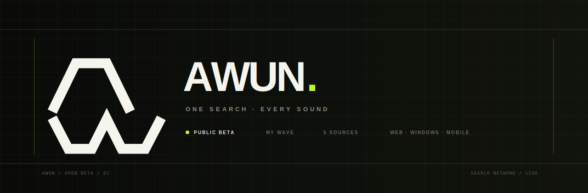

<div align="center">

[English](README.md) · [Русский](README.ru.md) · [Открыть AWUN](https://awun-api1.onrender.com) · [Windows-сборки](https://github.com/Loro66/AWUN/actions/workflows/build-windows-exe.yml) · [Поддержать проект](SUPPORT.md#русский) · [Лицензия](LICENSE.md#закрытая-freeware-лицензия-awun-10)

</div>

# AWUN

> Музыкальное пространство, которое ищет композиции в подключённых каталогах, хранит библиотеку на устройстве и превращает твой вкус в бесконечную персональную станцию.

AWUN параллельно ищет музыку в YouTube, SoundCloud, Audius, Jamendo и Internet Archive. MusicBrainz расширяет запросы: использует альтернативные написания, транслитерацию, релизы и ISRC. Недоступность одного источника не ломает остальные результаты.

## Что уже работает

- единый поиск с режимами `AUTO / CIS / EUROPE / USA / LATAM / ASIA / GLOBAL`;
- 30, 60 или 100 результатов и честное отображение отключённых источников;
- **MY WAVE** — бесконечная очередь со знакомым/новым, настроением, активностью, языком и эпохой;
- лайки, дизлайки и исключение артиста из будущих рекомендаций;
- локальная библиотека и импорт публичного плейлиста по ссылке;
- перенос CSV, JSON, M3U и TXT с автоматическим поиском проигрываемых совпадений;
- официальный YouTube Player, перемотка, повтор трека/очереди и Media Session;
- тексты LRCLIB, Genius-аннотации при наличии серверного токена и личные комментарии к строкам;
- шесть тем, минимальный режим и адаптивный интерфейс;
- web/PWA, Windows, Android и iOS beta shells.

## Попробовать и установить

- **Web / PWA:** открой [awun-api1.onrender.com](https://awun-api1.onrender.com). В Chrome или Edge нажми **INSTALL APP** — AWUN появится в меню «Пуск», на рабочем столе или домашнем экране телефона.
- **Windows:** скачай артефакт `AWUN-Windows-x64` в [Windows desktop builds](https://github.com/Loro66/AWUN/actions/workflows/build-windows-exe.yml). Бета пока не подписана коммерческим сертификатом, поэтому SmartScreen может показать предупреждение.
- **Мобильная beta:** инструкции и воспроизводимые оболочки находятся в [`mobile/`](mobile/README.md). Для установки на физический iPhone нужна подпись Apple.

## Быстрый запуск сервера

Нужен Python 3.11 или новее.

```bash
git clone https://github.com/Loro66/AWUN.git
cd AWUN
python -m venv .venv
# Windows: .venv\Scripts\activate
# Linux/macOS: source .venv/bin/activate
pip install -r requirements.txt
uvicorn backend.api.main:app --reload
```

Открой `http://127.0.0.1:8000/`, документация API находится в `/docs`. Для YouTube рекомендуется задать `AWUN_YOUTUBE_API_KEY`; остальные переменные описаны в [README.md](README.md#configuration) и [.env.example](.env.example).

## Важные ограничения

AWUN не является VPN и не обходит региональные или провайдерские ограничения. Он не открывает приватные библиотеки без официальной авторизации, не снимает DRM и не превращает потоковые плейлисты в «скачанные MP3». Кнопка скачивания появляется только когда источник действительно разрешает получить публичный файл.

Проект бесплатный. Пожертвования поддерживают разработку и серверы, но не продают музыку, доступ к каталогам или защищённые загрузки. Подробности — в [SUPPORT.md](SUPPORT.md#русский).

AWUN — **закрытое проприетарное freeware-приложение с доступным для просмотра
кодом**, а не open-source проект. Официальную неизменённую сборку можно
использовать бесплатно и передавать другим на условиях лицензии. Продажа,
перепаковка, публикация изменённых сборок, запуск клонов и использование кода в
другом продукте требуют письменного разрешения. Полные условия:
[LICENSE.md](LICENSE.md#закрытая-freeware-лицензия-awun-10) и [EULA.md](EULA.md#русский).

## Технологии

Python 3.11+, FastAPI, aiohttp, Pydantic, yt-dlp, Web Audio/Media Session, pywebview, GitHub Actions.

Техническая документация, API и условия запуска подробно описаны в [английском README](README.md). Ошибки и предложения можно оставить в [Issues](https://github.com/Loro66/AWUN/issues).

## Лицензия

Copyright © 2026 Loro66. Все права защищены.

Действует двуязычная [закрытая freeware-лицензия AWUN 1.0](LICENSE.md#закрытая-freeware-лицензия-awun-10).
Публичный репозиторий предназначен для прозрачности и вкладов, но код не
является open source. Для pull request действует
[соглашение с участником](CONTRIBUTOR_LICENSE_AGREEMENT.md#соглашение-с-участником-awun-10).
