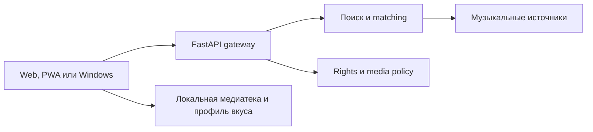

<div align="center">

[English](README.md) · [Русский](README.ru.md)

[](https://awun-1.onrender.com)
[](https://github.com/Loro66/AWUN/releases/latest/download/AWUN-Setup-x64.exe)
[](https://github.com/Loro66/AWUN/releases/latest)

[](https://github.com/Loro66/AWUN/actions/workflows/build-windows-exe.yml)
[](https://github.com/Loro66/AWUN/actions/workflows/frontend-e2e.yml)
[](https://www.python.org/)
[](https://fastapi.tiangolo.com/)
[](LICENSE.md)

**Local-first музыкальное пространство для разрозненных каталогов.**<br>
Один поиск по подключённым источникам, локальная медиатека и продолжение воспроизведения при отказе провайдера.

[Возможности](#возможности) · [Архитектура](docs/ARCHITECTURE.md) · [Тестирование](docs/TESTING.md) · [Справка о проекте](docs/PROJECT_CASE_STUDY.ru.md) · [Дорожная карта](ROADMAP.ru.md)

</div>

<p align="center">
  
</p>

## Зачем существует AWUN

Поиск музыки разделён между сервисами, регионами, языками и системами письма. Нужная запись может находиться на одной платформе и не воспроизводиться на другой; сохранённые ссылки на поток устаревают; один медленный источник задерживает весь поиск.

AWUN рассматривает такие сбои как штатное состояние системы.

| Проблема | Решение AWUN |
| --- | --- |
| Результаты разбросаны между каталогами | Параллельный поиск с постепенным появлением ответов каждого источника |
| Один провайдер завис или недоступен | Частичные результаты, тайм-ауты, повтор и отдельная диагностика |
| Сохранённая ссылка на поток устарела | Обновление ссылки у исходного провайдера перед воспроизведением |
| Активный источник перестал работать | Безопасный поиск близкого совпадения с восстановлением позиции |
| Медиатека привязана к аккаунту | Локальный импорт CSV, JSON, M3U и TXT с поиском проигрываемых совпадений |
| Названия отличаются между языками | Алиасы MusicBrainz, транслитерация, названия релизов и ISRC |

## Возможности

| Поиск | Воспроизведение | Личные данные | Диагностика |
| --- | --- | --- | --- |
| Интеграции YouTube, SoundCloud, Audius, Jamendo и Internet Archive | Официальный YouTube Player, HLS, waveform и Media Session | Локальная медиатека, очередь, резервная копия и восстановление | Состояние источников, задержка, безопасный технический отчёт |
| AUTO и региональные режимы поиска | Играть следующим, добавить, переставить, повторить | Без обязательного аккаунта и рекламного профиля | Track Stories, тексты LRCLIB и опциональные Genius-аннотации |

### Моя волна

«Моя волна» создаёт непрерывную очередь из активного трека, локальной медиатеки и сигналов вкуса на устройстве. Знакомое или новое, настроение, занятие, язык и эпоха меняют подбор без загрузки профиля на сервер.

<p align="center">
  
</p>

## Как это устроено


```mermaid
flowchart LR
    C["Web, PWA или Windows"] --> A["FastAPI gateway"]
    A --> S["Поиск и matching"]
    S --> P["Музыкальные источники"]
    A --> R["Rights и media policy"]
    C --> L["Локальная медиатека и профиль вкуса"]
```

Windows-версия упаковывает frontend и FastAPI backend в один EXE, запускает API на случайном локальном порту и сначала выполняет поиск локально. Публичный backend AWUN используется только как резерв для отдельного недоступного источника.

Ответы провайдеров приводятся к общей модели трека, очищаются от дубликатов и ранжируются. При восстановлении воспроизведения альтернативная запись принимается только при достаточно близком совпадении названия, исполнителя и длительности.

[Подробная архитектура](docs/ARCHITECTURE.md) · [Документация API](https://awun-1.onrender.com/docs)

## Установка и запуск

### Windows

Скачай [установщик для текущего пользователя](https://github.com/Loro66/AWUN/releases/latest/download/AWUN-Setup-x64.exe) или [portable EXE](https://github.com/Loro66/AWUN/releases/latest/download/AWUN.exe). Рядом с каждым файлом в релизе опубликован SHA-256.

Бета-сборки пока не подписаны Authenticode-сертификатом, поэтому Windows SmartScreen может показать предупреждение. Перед запуском проверь контрольную сумму.

### Web и PWA

Открой [awun-1.onrender.com](https://awun-1.onrender.com). Chrome и Edge позволяют установить сайт как PWA через меню браузера.

### Локальная разработка

```bash
git clone https://github.com/Loro66/AWUN.git
cd AWUN
python -m venv .venv

# Linux / macOS
source .venv/bin/activate

# Windows PowerShell
# .venv\Scripts\Activate.ps1

pip install -r requirements.txt
uvicorn backend.api.main:app --reload
```

Открой `http://127.0.0.1:8000`. Переменные источников и развёртывание описаны в [технической справке](docs/TECHNICAL_REFERENCE.md).

## Проверенное качество релиза

Релиз `v1.10.5` автоматически собирается из `main` через GitHub Actions.

- **237 Python-тестов** проверяют поиск, ranking, matching, policy, надёжность, безопасность и desktop-упаковку.
- **26 Playwright-сценариев** проверяют постепенный поиск, отмену, тайм-аут источника, восстановление воспроизведения, очередь, большие медиатеки и адаптивность.
- Интерфейс и границы контролов проверяются на ширинах **1920, 1280, 1000 и 390 пикселей**.
- Windows workflow создаёт два EXE, рассчитывает SHA-256 и публикует GitHub Release только после успешных тестов.

[Стратегия тестирования и ограничения](docs/TESTING.md) · [GitHub Actions](https://github.com/Loro66/AWUN/actions) · [Последний релиз](https://github.com/Loro66/AWUN/releases/latest)

## Текущий статус

| Платформа | Статус | Где получить |
| --- | --- | --- |
| Web / PWA | Публичная бета | [Открыть приложение](https://awun-1.onrender.com) |
| Windows | Выпущенная неподписанная бета | [Скачать v1.10.5](https://github.com/Loro66/AWUN/releases/tag/v1.10.5) |
| Android | Воспроизводимая Play-сборка и пакет страницы магазина | Публикация требует подписи и тестирования в Play Console |
| iOS | Воспроизводимая неподписанная бета | Установка на устройства требует подписи Apple |

Публичная доступность не означает подтверждённую аудиторию. AWUN пока не заявляет количество пользователей, retention или выручку. В [проверяемой справке о проекте](docs/PROJECT_CASE_STUDY.ru.md) реализованные результаты отделены от будущего пользовательского пилота.

## Документация

| Документ | Содержание |
| --- | --- |
| [Архитектура](docs/ARCHITECTURE.md) | Компоненты, потоки данных, границы доверия и инженерные решения |
| [Тестирование](docs/TESTING.md) | Уровни проверок, CI, команды и ограничения |
| [Техническая справка](docs/TECHNICAL_REFERENCE.md) | API, конфигурация источников и развёртывание |
| [История релизов](CHANGELOG.md) | Изменения, заметные пользователю |
| [Справка о проекте](docs/PROJECT_CASE_STUDY.ru.md) | Проверяемые инженерные эпизоды и роль владельца |
| [Дорожная карта](ROADMAP.ru.md) | Следующие этапы с проверяемыми критериями готовности |
| [Безопасность](SECURITY.md) | Закрытая отправка отчётов об уязвимостях |
| [Участие в разработке](CONTRIBUTING.md) | Требования к изменениям и pull request |

## Осознанные ограничения

AWUN не является VPN, не снимает DRM и не открывает приватные медиатеки без официальной авторизации. YouTube работает через официальный встроенный плеер. Кнопка скачивания появляется только для разрешённого источником публичного файла. Доступность провайдеров и региональные лицензии продолжают действовать.

В проекте нет обязательного аккаунта, рекламы и аналитического SDK. Медиатека, очередь, настройки и профиль «Моей волны» остаются на устройстве. Точная схема данных описана в [privacy notice](frontend/privacy.html).

## Участие и лицензия

Сообщения об ошибках и целевые pull request приветствуются. Начни с [CONTRIBUTING.md](CONTRIBUTING.md), используй шаблоны Issues и добавляй тесты для изменений поведения.

AWUN является **проприетарным freeware-проектом с доступным для просмотра кодом**, а не open-source программой. Официальные неизменённые сборки можно бесплатно использовать на условиях [лицензии AWUN 1.0](LICENSE.md) и [EULA](EULA.md). Повторное использование кода и публикация изменённых сборок требуют письменного разрешения.

---

<div align="center">

Независимый продуктовый проект [Loro66](https://github.com/Loro66).<br>
[Релиз](https://github.com/Loro66/AWUN/releases/latest) · [Сообщить об ошибке](https://github.com/Loro66/AWUN/issues/new?template=bug_report.yml) · [Поддержать](SUPPORT.md#русский)

</div>
