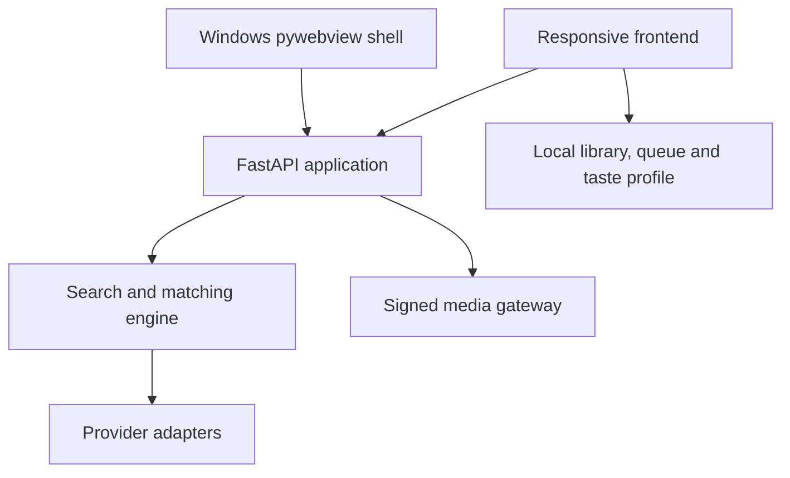
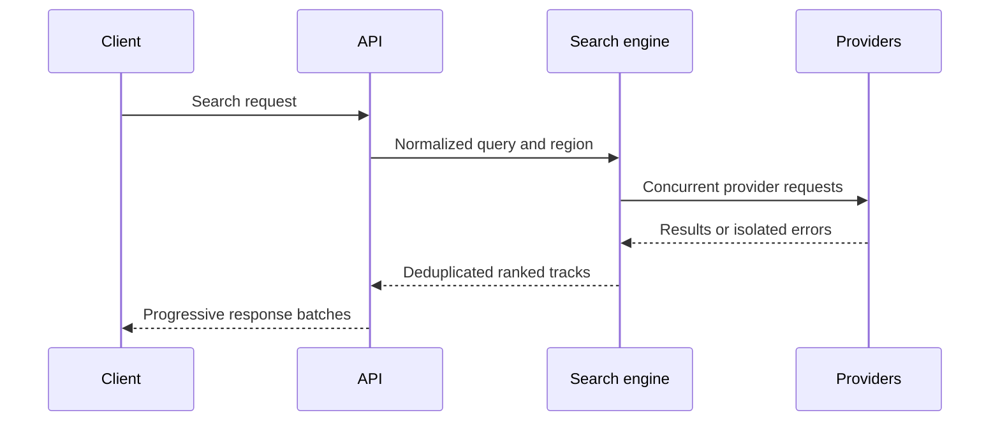
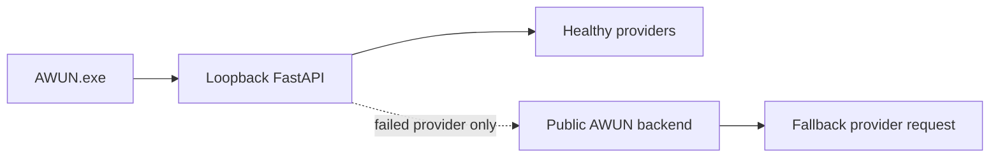
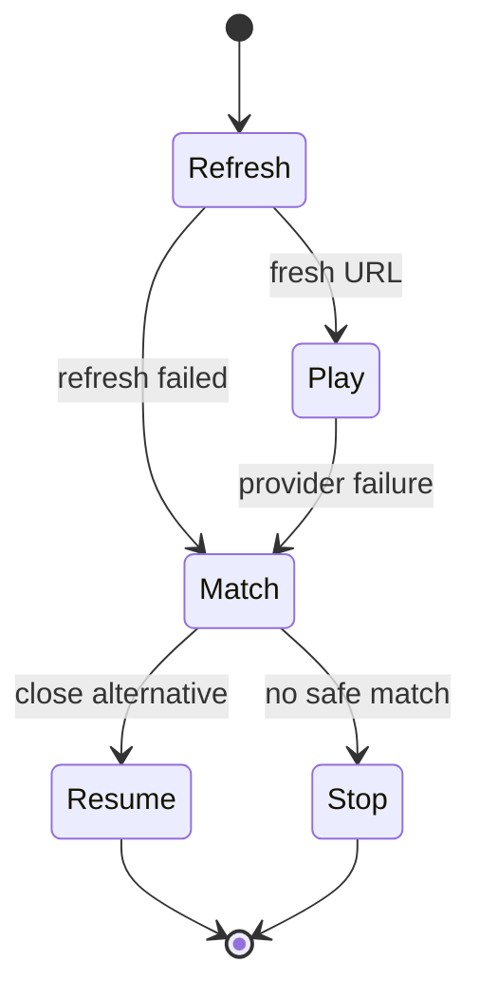

# AWUN architecture

[Project overview](../README.md) · [Testing](TESTING.md) · [Technical reference](TECHNICAL_REFERENCE.md)

AWUN is a local-first music discovery application. The same frontend runs as a web/PWA client, inside the Windows desktop shell and inside the mobile shells. The Python backend presents one normalized API over several independent provider adapters.

## System map

| Layer | Main modules | Responsibility |
| --- | --- | --- |
| Clients | `frontend/`, `desktop/`, `mobile/` | Interaction, playback, local state and platform packaging |
| API | `backend/api/main.py` | HTTP contract, lifecycle, policies and static application delivery |
| Search | `backend/search/` | Query intent, expansion, concurrent execution, identity, deduplication and ranking |
| Providers | `backend/sources/` | YouTube, SoundCloud, Audius, Jamendo and Internet Archive adapters |
| Reliability | `backend/reliability/` | Deadlines, retry, rate limiting, cache, circuit breaking and source health |
| Policy | `backend/policy/`, `backend/security/` | Rights capabilities, safe outbound URLs, signed cursors and media headers |
| Personalization | `backend/recommendations/`, `frontend/storage.js` | On-device taste profile and My Wave scoring inputs |
| Metadata | `backend/metadata/` | LRCLIB lyrics and optional Genius annotations |

## Search pipeline

1. The request is normalized into query intent, locale and region preferences.
2. MusicBrainz may add aliases, scripts, transliterations, release names and ISRC variants.
3. Enabled adapters run concurrently under separate deadlines.
4. Results are mapped to a shared track model and assigned stable identities.
5. Duplicates are merged and the connected catalogs are interleaved before ranking.
6. Client capabilities determine whether each result is stream-only or may expose a provider-supplied public download.
7. One provider failure is returned as source-level diagnostic data; successful sources still produce results.

Identical concurrent searches share one running provider operation. A short-lived cache avoids repeating the same network work immediately.

## Local-first desktop path

The Windows shell starts FastAPI on an ephemeral `127.0.0.1` port and points the embedded browser at it. The local API is always attempted first. A configured HTTPS backend receives only the request for a provider that failed locally; it does not replace already successful local results.

This design removes a mandatory private server from the desktop installation while preserving a controlled fallback for provider-specific network failures.

## Playback and recovery

Before playing an item from the saved library or queue, AWUN refreshes its potentially expired provider URL. If playback still fails, the client performs a new lookup and evaluates alternatives by normalized title, artist and duration.

The current position is restored only after a sufficiently close alternative has been selected. A late response from an older playback request cannot replace the user's newer track choice.

YouTube playback remains in the official visible embedded player. Supported SoundCloud HLS manifests are rewritten through short-lived signed media routes so that playlist resources follow the same controlled media path. The media gateway validates outbound URLs and redirects to reduce SSRF exposure.

## On-device state

AWUN has no required account and no application user database.

| Data | Storage | Server persistence |
| --- | --- | --- |
| Library and queue | Browser `localStorage` | None |
| My Wave taste signals | Browser `localStorage`, bounded history | None |
| Automatic recovery snapshot | Browser IndexedDB | None |
| Personal lyric-line notes | Browser `localStorage` | None |
| Search query | Sent for the requested search | Not stored by AWUN application code |

Import validates the backup schema and track values before replacing local state. If a write or migration fails, the previous data is restored.

## Reliability model

- Provider adapters fail independently.
- Search and playback requests have explicit deadlines.
- Repeated source failures feed circuit-breaker and diagnostic state.
- Retries are bounded and used only for eligible transient failures.
- Cache entries have finite lifetimes and bounded counts.
- Runtime reports redact credentials, authorization headers and known secret fields.
- The UI keeps partial search results after cancellation or a late-provider failure.

## Decisions and trade-offs

| Decision | Benefit | Trade-off |
| --- | --- | --- |
| Local-first Windows backend | No mandatory hosted server for desktop use | Larger binary and local process lifecycle |
| No required account | Minimal personal-data surface | No automatic cross-device synchronization |
| Progressive provider results | Useful results arrive without waiting for the slowest source | The list can grow while a user is interacting with it |
| High-confidence fallback matching | Playback may survive source failure | Recovery stops when identity confidence is insufficient |
| Source-visible proprietary license | Publicly reviewable implementation with controlled redistribution | Not compatible with unrestricted open-source reuse |

## Explicit non-goals

AWUN does not remove DRM, bypass provider authentication, guarantee geographic availability or turn streaming playlists into downloadable files. It does not simulate a social network or claim public usage metrics that have not been measured.

For exact environment variables, endpoints and provider behavior, continue to the [technical reference](TECHNICAL_REFERENCE.md).
